# Complete End-to-End Flow: User Input → Generated Code

## Table of Contents
1. [High-Level Pipeline Diagram](#1-high-level-pipeline-diagram)
2. [Step 1: CLI Entry Point](#2-step-1-cli-entry-point)
3. [Step 2: Pipeline Facade](#3-step-2-pipeline-facade)
4. [Step 3: RunPipeline Orchestrator (4 Phases)](#4-step-3-runpipeline-orchestrator)
5. [Step 4: ArchitectAgent — Blueprint Design](#5-step-4-architectagent)
6. [Step 5: PlannerAgent — Lifecycle Plan](#6-step-5-planneragent)
7. [Step 6: SimpleLoopExecutor — Tier-by-Tier Execution](#7-step-6-simpleloopexecutor)
8. [Step 7: AgentManager — Agent Factory & Context](#8-step-7-agentmanager)
9. [Step 8: ContextBuilder — What Each Agent Sees](#9-step-8-contextbuilder)
10. [Step 9: BaseAgent.execute_agentic() — The Core Loop](#10-step-9-baseagentexecute_agentic)
11. [Step 10: Tool Dispatch System](#11-step-10-tool-dispatch)
12. [Step 11: CoderAgent — Code Generation](#12-step-11-coderagent)
13. [Step 12: Build → Fix Loop](#13-step-12-build-fix-loop)
14. [Step 13: State Machine Transitions](#14-step-13-state-machine)
15. [Step 14: Post-Generation Phases](#15-step-14-post-generation)
16. [Step 15: Finalize & Reporting](#16-step-15-finalize)
17. [Complete Mermaid Diagram](#17-complete-mermaid-diagram)

---

## 1. High-Level Pipeline Diagram

```
User CLI Input
     │
     ▼
┌─────────────────┐
│   core/cli.py   │  Click CLI parses args → Settings object
└────────┬────────┘
         ▼
┌─────────────────┐
│  Pipeline       │  Thin facade: creates LLMClient, LiveConsole
│  (pipeline.py)  │  Delegates to RunPipeline/EnhancePipeline/FullstackPipeline
└────────┬────────┘
         ▼
┌─────────────────────────────────────────────────┐
│           RunPipeline.execute()                  │
│  Phase 1: Architecture  (ArchitectAgent)         │
│  Phase 2: Planning      (PlannerAgent)           │
│  Phase 3: Execution     (SimpleLoopExecutor)     │
│  Phase 4: Finalize      (RunReporter)            │
└──────────────────────┬──────────────────────────┘
                       ▼
              PipelineResult returned to CLI
```

---

## 2. Step 1: CLI Entry Point

**File:** `core/cli.py`  
**Framework:** Python Click

### Command Invocation
```bash
python -m core.cli generate "Build a REST API for user management" \
    --workspace ./output \
    --model claude-sonnet-4-20250514 \
    --provider anthropic \
    --max-agents 4
```

### What Happens
1. Click parses positional arg `prompt` and flags (`--workspace`, `--model`, `--provider`, `--sandbox`, `--max-agents`, `--skip-review`, `--skip-security`, `--skip-tests`, `--resume`)
2. Builds a `Settings` object:
   ```python
   Settings(
       workspace_dir=Path(workspace),
       llm=LLMConfig(provider=provider, model=model, api_key=...),
       sandbox=SandboxConfig(enabled=sandbox),
       max_concurrent_agents=max_agents,
       skip_agents=set(),  # populated from --skip-* flags
   )
   ```
3. Creates `Pipeline(settings, interactive=True)`
4. Calls `asyncio.run(pipeline.run(prompt, resume=resume))`

### Input → Output
| Input | Output |
|-------|--------|
| CLI string args | `Settings` object + `prompt` string |

---

## 3. Step 2: Pipeline Facade

**File:** `core/pipeline.py`  
**Class:** `Pipeline`

### `Pipeline.__init__(settings, interactive)`
- Creates `LLMClient(settings.llm)` — unified LLM interface (Anthropic/OpenAI/Gemini)
- Sets `max_cost_usd` guard
- Installs graceful shutdown handlers (SIGINT/SIGTERM)

### `Pipeline.run(prompt, resume, api_contract_path)`
1. **Resolves API contract**: explicit path → auto-detect in workspace → `None`
2. **Starts LiveConsole** (`core/live_console.py`) — Rich-based live terminal UI
3. **Starts file logging** — appends to `{workspace}/.codegen/run.log`
4. **Creates RunPipeline**:
   ```python
   RunPipeline(settings, llm_client, live_console, api_contract)
   ```
5. **Calls** `run_pipeline.execute(user_prompt, start_time, resume=resume)`
6. **Stops** LiveConsole and file logging on exit (finally block)
7. **Returns** `PipelineResult`

### Input → Output
| Input | Output |
|-------|--------|
| `prompt: str`, `Settings`, `LLMClient` | `PipelineResult(success, workspace_path, blueprint, stats, errors, elapsed, token_cost)` |

---

## 4. Step 3: RunPipeline Orchestrator

**File:** `core/pipeline_run.py`  
**Class:** `RunPipeline`

The main orchestrator with 4 sequential phases:

### Phase 1: Architecture Design

```python
architect = ArchitectAgent(llm_client, repo_manager, mcp_client)
blueprint = await architect.design_architecture(user_prompt)  # with timeout
```

1. Creates `RepositoryManager(workspace_dir)` — file I/O abstraction
2. Initializes MCP client if configured (external tool extensions)
3. Sets up observability/tracing
4. Calls `architect.design_architecture(user_prompt)` with timeout
5. **Blueprint validation** (`_validate_blueprint()`):
   - Must have file_blueprints, name, tech_stack
   - No duplicate file paths
   - No dangling dependency references
6. **Retry loop** (guarded by `feature("BLUEPRINT_RETRY")`):
   - Up to `blueprint_max_retries` attempts
   - Feeds validation errors back as corrective prompt
7. **Language detection**: `detect_language_from_blueprint(blueprint.tech_stack)`
8. **Approval gate** (optional): Human can approve/reject/revise the architecture
9. `repo_manager.initialize(blueprint)` — creates workspace folder structure

### Phase 2: Task Planning

```python
planner = PlannerAgent(llm_client, repo_manager, mcp_client)
lifecycle_engine, global_graph = await planner.create_lifecycle_plan(
    blueprint, max_review_fixes=2
)
```

1. Creates `PlannerAgent`
2. `PlannerAgent.create_lifecycle_plan()` delegates to `LifecyclePlanBuilder.build()`:
   - Creates a `LifecycleEngine` with per-file state machines
   - Creates a slim `TaskGraph` for advisory tasks (deploy, docs)
   - Validates blueprint dependencies (resolves short-path references)
   - Marks config/deploy/test files to skip testing
3. Determines if language is compiled (has `build_command`)

**Output:**
- `LifecycleEngine` — event-sourced FSM per file  
- `TaskGraph` — global advisory DAG (deploy, docs tasks)

### Phase 3: Code Execution

```python
sandbox = SandboxOrchestrator(settings)
sb = await sandbox.setup(lang_profile)  # Docker containers

agent_manager = AgentManager(
    settings, llm_client, repo_manager, blueprint,
    live_console, sb.manager, sb.build_id, sb.test_id,
    dep_store, embedding_store, event_bus, mcp_client, api_contract,
)

tiers = tier_scheduler.compute_tiers(file_paths, file_deps)

executor = SimpleLoopExecutor(agent_manager, settings, lang_profile, event_bus)
exec_result = await executor.execute(lifecycle_engine, global_graph, tiers=tiers, pipeline_def=...)
```

1. **Sandbox setup**: Docker containers for build + test isolation
2. **Dependency store + Embedding store**: ChromaDB for semantic search
3. **EventBus**: Pub/sub for agent events
4. **AgentManager**: Factory + coordination hub (creates all agents)
5. **TierScheduler**: Computes dependency tiers:
   - Tier 0: files with no deps (models, configs)
   - Tier 1: files depending only on Tier 0 (repositories)
   - Tier 2+: cascading dependencies (services → controllers)
6. **SimpleLoopExecutor.execute()**: The core generation engine

### Phase 4: Finalize

1. `index_workspace(repo_manager, settings)` — updates file index
2. Computes success metrics:
   - `code_success`: all files generated + built correctly
   - `tests_passed`: no test degradation
   - `security_passed`: security checkpoint (soft gate)
   - `integration_passed`: integration checkpoint (soft gate)
3. `RunReporter.write_run_report()` — JSON report to workspace
4. Returns `PipelineResult` with all stats

---

## 5. Step 4: ArchitectAgent

**File:** `agents/architect_agent.py`  
**Inherits:** `BaseAgent`  
**Role:** `AgentRole.ARCHITECT`

### `design_architecture(user_prompt) → RepositoryBlueprint`

**Two LLM calls:**

#### Call 1: File Blueprints + Tech Stack
- **System prompt**: Detailed instructions for language detection, DB selection, layered architecture design, JSON output format
- **User prompt**: User's request + injected DB note if no DB was specified
- **Max tokens**: 12,288
- **Output**: JSON object with:
  ```json
  {
    "name": "project-name",
    "description": "...",
    "architecture_style": "REST",
    "tech_stack": {"language": "java", "framework": "spring-boot", "db": "h2", "build_tool": "maven"},
    "folder_structure": ["src/main/java/com/example/models", ...],
    "file_blueprints": [
      {
        "path": "src/main/java/.../UserModel.java",
        "purpose": "User entity with JPA annotations",
        "depends_on": [],
        "exports": ["User"],
        "language": "java",
        "layer": "model"
      }
    ]
  }
  ```
- **Caching**: SHA-256 hash of prompt → `.arch_cache/{hash}.json`
- **Retry on parse failure**: Asks LLM to fix its own malformed JSON

#### Call 2: Architecture Doc (separate, non-critical)
- Generates Markdown architecture documentation
- Fetched separately to avoid truncation of the main JSON

### Input → Output
| Input | Output |
|-------|--------|
| `user_prompt: str` (e.g. "Build REST API for user mgmt") | `RepositoryBlueprint` with name, tech_stack, 10-30 FileBlueprints |

---

## 6. Step 5: PlannerAgent

**File:** `agents/planner_agent.py` → `core/task_engine.py`  
**Class:** `LifecyclePlanBuilder`

### `create_lifecycle_plan(blueprint) → (LifecycleEngine, TaskGraph)`

**No LLM calls** — pure computation:

1. **Validates dependencies**: Resolves short-path refs (`models/User.java` → `src/main/java/.../User.java`)
2. **Creates LifecycleEngine**:
   - One `FileLifecycle` per file blueprint
   - Each starts at `FilePhase.PENDING`
   - Tracks: `max_review_fixes=2`, `max_test_fixes=3`, `max_build_fixes=3`
3. **Creates global TaskGraph** (advisory):
   - Deploy task (fire-and-forget)
   - Docs task (fire-and-forget)
   - Security sentinel (marks when security can run)

### Input → Output
| Input | Output |
|-------|--------|
| `RepositoryBlueprint` (N file blueprints) | `LifecycleEngine` (N state machines) + `TaskGraph` (advisory DAG) |

---

## 7. Step 6: SimpleLoopExecutor

**File:** `core/simple_loop_executor.py`  
**The core execution engine.**

### `execute(lifecycle_engine, global_graph, tiers, pipeline_def) → dict`

```
FOR each tier (0, 1, 2, ...):
    FOR each file in tier (PARALLEL with semaphore):
        _process_file(engine, file_path) → FileLoopResult
    
    Cascade failures to downstream tiers
    Clear context cache between tiers

GLOBAL BUILD (compiled languages)
TEST GENERATION (optional)
SECURITY CHECKPOINT (optional)
INTEGRATION CHECKPOINT (optional)
ADVISORY TASKS (deploy, docs)
```

### Per-File Loop: `_process_file(engine, file_path)`

```
Attempt 0: GENERATE
  ├── _generate_file() → CoderAgent writes the file
  ├── State: PENDING → GENERATING → REVIEWING → BUILDING
  └── If linter/build passes → FilePhase.PASSED ✓

Attempt 1-4: FIX (on build failure)
  ├── _fix_file() → CoderAgent rewrites with error_history context
  ├── _run_incremental_build() → compile/lint check
  ├── Parse errors → attribute to this file
  ├── Check stalled progress (same error hash repeating)
  └── If build passes → FilePhase.PASSED ✓
       If retries exhausted → FilePhase.FAILED ✗
```

**Key decisions:**
- MAX_ATTEMPTS = 5 per file (1 generate + 4 fixes)
- MAX_ERROR_CHARS = 8000 (compiler output fed to fix agent)
- Per-module build locks (not global) for parallelism
- Per-file token budget tracking (`feature("TOKEN_BUDGETS")`)
- Fix memory store records attempts for cross-file learning
- Context cache shared within tier, cleared between tiers

### Input → Output
| Input | Output |
|-------|--------|
| `LifecycleEngine` + tiers list | `dict` with stats (passed/failed/degraded), metrics, checkpoint results |

---

## 8. Step 7: AgentManager

**File:** `core/agent_manager.py`  
**The agent factory and coordination hub.**

### Agent Registry (TaskType → Agent Class)

| TaskType | Agent Class | Purpose |
|----------|-------------|---------|
| `GENERATE_FILE` | `CoderAgent` | Write new source file |
| `FIX_CODE` | `CoderAgent` | Fix build errors |
| `REVIEW_FILE` | `ReviewerAgent` | Code review |
| `GENERATE_TEST` | `TestAgent` | Generate unit tests |
| `SECURITY_SCAN` | `SecurityAgent` | Security audit |
| `MODIFY_FILE` | `PatchAgent` | Modify existing file (enhance pipeline) |
| `GENERATE_DEPLOY` | `DeployAgent` | Deployment configs |
| `GENERATE_DOCS` | `WriterAgent` | Documentation |
| `VERIFY_BUILD` | `BuildVerifierAgent` | Build verification |
| `GENERATE_INTEGRATION_TEST` | `IntegrationTestAgent` | Integration tests |
| `PLAN_PRODUCT` | `ProductPlannerAgent` | Fullstack product planning |
| `GENERATE_API_CONTRACT` | `APIContractAgent` | API contract generation |
| `GENERATE_COMPONENT` | `ComponentGeneratorAgent` | Frontend components |
| `INTEGRATE_API` | `APIIntegrationAgent` | API integration |
| `MANAGE_STATE` | `StateManagementAgent` | State management |

### `_create_agent(task_type) → BaseAgent`
- Looks up agent class from `TASK_AGENT_MAP`
- Wires in the correct terminal:
  - `TestAgent`, `IntegrationTestAgent` → test sandbox terminal
  - `SecurityAgent`, `BuildVerifierAgent` → build sandbox terminal
  - All others → no terminal (file tools only)
- Injects: `llm_client`, `repo_manager`, `mcp_client`

### `_execute_lifecycle_phase(engine, file_path, phase)`
1. Maps phase → task config (task_type, success/failure events, description)
2. Builds a synthetic `Task` object
3. Calls `_build_agent_context(task)` → runs `ContextBuilder.build()` in a thread
4. Creates agent via `_create_agent()`
5. Calls `agent.execute(context)` → records metrics
6. Fires lifecycle events based on result (REVIEW_PASSED/FAILED, CODE_GENERATED, etc.)

---

## 9. Step 8: ContextBuilder

**File:** `core/context_builder.py`  
**What each agent "sees" when executing.**

### `build(task) → AgentContext`

Returns:
```python
AgentContext(
    task=task,                         # The current task (file, type, description)
    blueprint=blueprint,               # Full repository blueprint
    file_blueprint=file_bp,            # This file's specific blueprint
    related_files=related,             # Dict[path → content] with priority ordering
    architecture_summary=arch_doc,     # Architecture markdown doc
    dependency_info=dep_info,          # Dependency graph info
    api_contract=api_contract,         # API contract (if available)
)
```

### Priority-Ranked File Collection (`_collect_ranked`)

Files are collected in strict priority order with budget enforcement:

| Priority | Source | Content Format | Relevance |
|----------|--------|---------------|-----------|
| **1** | Target file (for FIX_CODE, REVIEW_FILE, GENERATE_TEST) | Full source | 1.0 |
| **2** | Direct blueprint dependencies (`depends_on`) | AST stubs (signatures only) | 0.9 |
| **2b** | Error-referenced files (FIX_CODE only) | AST stubs | 0.95 |
| **3** | Semantic search hits (ChromaDB embeddings) | AST stubs | 0.0–1.0 |
| **4** | Module review files (REVIEW_MODULE) | AST stubs | 0.5–0.9 |

**Budget controls:**
- `max_context_chars` — total character budget
- `max_direct_deps` — cap on dependency files included
- `max_semantic_hits` — cap on embedding search results
- `max_same_layer` — per-layer diversity cap (prevents model-layer flooding)
- AST stubs via `ASTExtractor` — extracts method signatures, ~80% size reduction
- `_smart_truncate()` — preserves imports + tail signatures when AST fails

---

## 10. Step 9: BaseAgent.execute_agentic()

**File:** `agents/base_agent.py`  
**The core agentic tool-use loop that ALL agents share.**

### Flow Diagram

```
┌─────────────────────────────────────────────────────┐
│  execute_agentic(context)                            │
│                                                      │
│  messages = [{"role": "user", "content": prompt}]    │
│                                                      │
│  FOR iteration in 0..max_iterations:                 │
│    │                                                 │
│    ├── compact_messages() if context too large        │
│    ├── Check token budget (TOKEN_BUDGETS feature)     │
│    │                                                 │
│    ├── LLM CALL (with heartbeat):                    │
│    │   ├── STREAMING_LLM? → generate_with_tools_streaming()
│    │   └── else → generate_with_tools()              │
│    │                                                 │
│    ├── Handle ContextOverflowError:                  │
│    │   └── REACTIVE_COMPACTION → aggressive compact  │
│    │                                                 │
│    ├── IF stop_reason == "end_turn":                 │
│    │   ├── Target file not written?                  │
│    │   │   ├── Inject write_file reminder (2x)       │
│    │   │   └── Auto-extract code block fallback      │
│    │   └── Return TaskResult                         │
│    │                                                 │
│    ├── IF stop_reason == "max_tokens" (truncated):   │
│    │   └── Inject continuation prompt                │
│    │                                                 │
│    ├── TOOL CALLS:                                   │
│    │   ├── Partition: safe (parallel) vs unsafe (seq)│
│    │   ├── Execute via _dispatch_tool()              │
│    │   ├── Track files_written                       │
│    │   └── Budget nudge if past halfway              │
│    │                                                 │
│    ├── Quality checks:                               │
│    │   ├── TRUNCATED CODE DETECTED? → keep going     │
│    │   └── STUB CODE DETECTED? → keep going          │
│    │                                                 │
│    ├── Target file written? → Return TaskResult ✓    │
│    │                                                 │
│    └── Stagnation detection (multi-file agents)      │
│                                                      │
│  RAISE RuntimeError if max_iterations exceeded       │
└─────────────────────────────────────────────────────┘
```

### Key Mechanisms

**Token Budget Tracking:**
- `_session_tokens` accumulates across iterations
- `_agent_token_budget` from `ExecutionConfig`
- Exits gracefully when budget exhausted

**Context Compaction:**
- `compact_messages(messages, char_budget)` — preserves first prompt + recent tool interactions
- Reactive compaction on `ContextOverflowError` — aggressive shrink + retry
- Max 3 overflow compactions before giving up

**End-Turn Recovery:**
- If LLM stops without writing target file:
  1. Inject "call write_file NOW" reminder (up to 2 attempts)
  2. Auto-extract longest code block from response and write it
- Prevents wasted iterations from models that output code as text

**Budget Guard Nudges:**
- Past halfway with no write → inject warning in tool results
- Multi-file: zero-writes nudge after 1/3 budget
- Stagnation detection: exit if no new writes for consecutive iterations

---

## 11. Step 10: Tool Dispatch

**File:** `agents/base_agent.py` → `_dispatch_tool()`  
**Available tools defined in:** `core/agent_tools.py`

### Tool Definitions

| Tool | Description | Safe? | Used By |
|------|-------------|-------|---------|
| `read_file` | Read file content (chunked for large files) | ✅ | All agents |
| `write_file` | Write/overwrite a file | ❌ | Coder, Patch, Component agents |
| `apply_patch` | Apply unified diff patch | ❌ | Patch agent |
| `search_code` | Regex search across workspace | ✅ | All agents |
| `find_definition` | Find symbol definition | ✅ | All agents |
| `list_files` | List directory contents | ✅ | All agents |
| MCP tools | Dynamically fetched from MCP server | varies | Any agent |

### Dispatch Flow

```python
async def _dispatch_tool(context, tool_call):
    # 1. Permission check (write_file, apply_patch)
    if permission_checker and tool is write/patch:
        result = checker.check_write(path, agent_name)
        if not allowed → return "Error: permission denied"
    
    # 2. Input validation (JSON Schema + Pydantic)
    validation_err = validate_tool_input_strict(tool_name, input)
    if err → return "Error: {err}"
    
    # 3. Dispatch to handler
    handlers = {
        "read_file": _tool_read_file,
        "write_file": _tool_write_file,
        "search_code": _tool_search_code,
        "find_definition": _tool_find_definition,
        "list_files": _tool_list_files,
        "apply_patch": _tool_apply_patch,
    }
    
    # 4. Or dispatch to MCP tool
    if tool not in handlers and mcp_client has tool:
        return await mcp_client.execute_tool(name, input)
    
    # 5. Execute with timeout
    return await asyncio.wait_for(handler(input), timeout=tool_timeout_seconds)
```

### Concurrency Model
- **Safe tools** (read_file, search_code, find_definition, list_files): Run in parallel via `asyncio.gather()`
- **Unsafe tools** (write_file, apply_patch): Run sequentially (order-preserving)

### Write File Quality Checks
After `write_file` succeeds:
1. **Truncation detection**: Count unbalanced braces/brackets → "TRUNCATED CODE DETECTED" warning
2. **Stub detection**: Scan for `TODO`, `throw new UnsupportedOperationException`, empty bodies → "STUB CODE DETECTED" warning
3. Both warnings are fed back to LLM for rewrite

---

## 12. Step 11: CoderAgent

**File:** `agents/coder_agent.py`  
**Role:** `AgentRole.CODER`

### Generation Flow (GENERATE_FILE)

**System Prompt** (language-specific):
- Expert {language} developer agent
- Must output only raw code via `write_file` tool
- Every class/method must be fully implemented (no stubs)
- Must match exact import paths and method signatures from dependencies

**User Prompt** (`_build_prompt`):
```
{formatted_context with related files, architecture summary}

Generate the complete {language} file for: {file_path}
Purpose: {file_purpose}
Layer: {layer}
Must export: {export_list}

{API contract section if controller layer}
{Dependency method signatures extracted inline}

INSTRUCTIONS:
1. Check Related Files — AST stubs show EXACT method names
2. Use read_file if dependency not shown
3. Write COMPLETE code via write_file

COMPLETENESS CHECKLIST:
- Every export defined
- Every import matches real dependency
- Every method has full implementation
- All error cases handled
```

**Tools available:** `CODER_TOOLS` (read_file, search_code, find_definition, write_file, apply_patch, list_files)

### Fix Flow (FIX_CODE)

Same agent, different prompt:
```
{formatted_context with target file, error history}

Fix the build errors in: {file_path}

ERROR HISTORY:
  Attempt 1: {error_text_1} [hash: abc123]
  Attempt 2: {error_text_2} [hash: def456]  ← SAME errors, ESCALATING

{Referenced files from error messages as AST stubs}

Fix ALL errors. Do NOT introduce new errors.
Call write_file with the fixed complete file content.
```

### Config File Generation
For non-source files (pom.xml, application.properties, etc.):
- Different system prompt: "You are a configuration file generator"
- Format-specific instructions (XML, YAML, properties, etc.)

### Rewrite Validation (`_validate_rewrite`)
Before accepting any write:
1. **Size guard**: Reject if `new_size > original_size × MAX_CONTENT_GROWTH`
2. **Duplicate detection**: Reject if duplicate class/function definitions found
3. **Identity check**: Skip write if content identical
4. **Java package validation**: Auto-correct package declaration mismatches

---

## 13. Step 12: Build → Fix Loop

**File:** `core/simple_loop_executor.py` → `_process_file()`

```
┌─────────────────────────────────────────┐
│ ATTEMPT 0: Generate                      │
│   CoderAgent writes file via agentic loop│
│   State: PENDING → GENERATING → REVIEWING│
│   Skip review: REVIEWING → BUILDING      │
├─────────────────────────────────────────┤
│ BUILD CHECK:                             │
│   Compiled → _run_incremental_build()    │
│   Interpreted → _lint_check()            │
│   ├── PASSED → FilePhase.PASSED ✓        │
│   └── FAILED → parse errors ↓           │
├─────────────────────────────────────────┤
│ ERROR ATTRIBUTION:                       │
│   CompilerErrorAttributor.attribute()    │
│   Map errors → specific files            │
│   Extract error lines (max 8000 chars)   │
│   Compute error_hash (MD5)               │
├─────────────────────────────────────────┤
│ STALL DETECTION:                         │
│   Same error_hash as last attempt?       │
│   → Will escalate prompt on next attempt │
├─────────────────────────────────────────┤
│ ATTEMPT 1-4: Fix                         │
│   CoderAgent rewrites with error_history │
│   error_history = [                      │
│     {errors_text, error_hash, attempt,   │
│      referenced_files}                   │
│   ]                                      │
│   _fix_memory records for cross-file     │
│   learning                               │
│   State: FIXING → BUILD check → loop     │
├─────────────────────────────────────────┤
│ TERMINAL STATES:                         │
│   Build passes → FilePhase.PASSED ✓      │
│   Retries exhausted → FilePhase.FAILED ✗ │
│   Build fixes exceeded → DEGRADED ⚠     │
│   Token budget exhausted → FAILED ✗      │
└─────────────────────────────────────────┘
```

### Error Attribution (`core/error_attributor.py`)
- Parses compiler output (Maven, Go, TypeScript, Rust, etc.)
- Maps error lines to specific source files
- Extracts error lines (truncated to MAX_ERROR_CHARS)
- Identifies referenced files for inclusion in fix context

### Fix Memory Store (`memory/fix_memory_store.py`)
- Records every fix attempt (file, errors, hash, referenced files)
- Records resolutions when build passes
- Enables cross-file learning (same error pattern → known fix)

---

## 14. Step 13: State Machine

**File:** `core/state_machine.py`

### FilePhase Transitions

```
PENDING ──DEPS_MET──→ GENERATING ──CODE_GENERATED──→ REVIEWING
                                                        │
                                 ┌──REVIEW_PASSED──→ BUILDING
                                 │                      │
                          REVIEWING                     │
                                 │               ┌──BUILD_PASSED──→ TESTING
                                 │               │                    │
                          REVIEW_FAILED          BUILDING              │
                                 │               │              ┌──TEST_PASSED──→ PASSED ✓
                                 ▼               │              │
                              FIXING      BUILD_FAILED      TESTING
                                 │               │              │
                                 │               ▼          TEST_FAILED
                                 │            FIXING            │
                                 │               │              ▼
                                 └───FIX_APPLIED─┘           FIXING
                                                               │
                                                        FIX_APPLIED → TESTING
                                                        (or RETRIES_EXHAUSTED → FAILED)

Special: RETRIES_EXHAUSTED → FAILED (from any phase)
Special: Build fixes exceeded → DEGRADED (terminal, but code exists)
```

### Per-File Lifecycle Tracking
```python
FileLifecycle:
    phase: FilePhase
    review_fix_count: int       # current / max_review_fixes
    test_fix_count: int         # current / max_test_fixes
    build_fix_count: int        # current / max_build_fixes
    fix_trigger: str            # "review" | "test" | "build"
    review_findings: list[str]  # from ReviewerAgent
    build_errors: str           # from compiler
    test_errors: str            # from test runner
    event_log: list[Event]      # append-only audit trail
```

---

## 15. Step 14: Post-Generation Phases

After all tiers complete their generate→build→fix loops:

### 1. Global Build (compiled languages only)
```python
if compiled:
    global_build_ok = await _global_build(engine)
```
Final full-project build to catch cross-file issues.

### 2. Test Generation (optional, unless `--skip-tests`)
```python
await _run_test_phase(engine)
```
- `TestAgent` generates unit tests for each file
- State: BUILDING → TEST_PASSED → PASSED, or TEST_FAILED → FIXING → re-test

### 3. Security Checkpoint (optional, unless `--skip-security`)
```python
security_result = await _run_security_checkpoint(pipeline_def.security_checkpoint)
```
- `SecurityAgent` scans for vulnerabilities
- Soft gate — failures result in DEGRADED quality, not pipeline failure

### 4. Integration Checkpoint (optional, unless `--skip-integration`)
```python
integration_result = await _run_integration_checkpoint(pipeline_def.integration_checkpoint)
```
- `IntegrationTestAgent` runs cross-file integration tests
- Soft gate

### 5. Advisory Tasks (deploy, docs)
```python
await agent_manager.execute_graph(global_graph)
```
- `DeployAgent` generates Dockerfile, docker-compose.yml
- `WriterAgent` generates README.md, API docs

---

## 16. Step 15: Finalize & Reporting

### Workspace Indexing
```python
index_workspace(repo_manager, settings)
```
Updates the repository file index with checksums and metadata.

### Success Determination
```python
code_success = (
    stats["failed"] == 0 and
    stats["blocked"] == 0 and
    stats["lifecycle_failed"] == 0 and
    stats["final_build_passed"] and
    all_checkpoints_passed
)
```

### Token Cost Calculation
```python
TokenCost(
    input_tokens=llm.total_input_tokens,
    output_tokens=llm.total_output_tokens,
    model=llm.config.model,
    cost_usd=calculate_cost(model, input, output),
)
```

### Run Report
```python
RunReporter(workspace_dir).write_run_report(
    prompt, blueprint, task_graph, stats, elapsed, success, token_cost
)
```
Writes a JSON report to `{workspace}/.codegen/run_report.json`.

### Final Output: `PipelineResult`
```python
PipelineResult(
    success=True/False,
    workspace_path="/path/to/output",
    blueprint=RepositoryBlueprint(...),
    task_stats={"passed": 15, "failed": 0, "degraded": 1, ...},
    metrics={"tasks_completed": 15, ...},
    errors=[],
    elapsed_seconds=120.5,
    token_cost=TokenCost(input=50000, output=80000, cost_usd=0.45),
)
```

---

## 17. Complete Mermaid Diagram

```mermaid
flowchart TD
    A[User: python -m core.cli generate 'Build REST API'] --> B[core/cli.py: Click parses args]
    B --> C[Settings object created]
    C --> D[Pipeline.__init__: LLMClient + LiveConsole]
    D --> E[Pipeline.run: resolve API contract]
    E --> F[RunPipeline.execute]

    subgraph Phase1["Phase 1: Architecture"]
        F --> G[ArchitectAgent.design_architecture]
        G --> H[LLM Call 1: Blueprint JSON<br/>system: architect prompt<br/>user: effective_prompt<br/>max_tokens: 12288]
        H --> I[Parse JSON → RepositoryBlueprint]
        I --> J[LLM Call 2: Architecture Doc<br/>Markdown documentation]
        J --> K[Validate blueprint<br/>retry loop if errors]
        K --> L[detect_language_from_blueprint]
        L --> M[Optional: Human approval gate]
        M --> N[repo_manager.initialize: create folders]
    end

    subgraph Phase2["Phase 2: Planning"]
        N --> O[PlannerAgent.create_lifecycle_plan]
        O --> P[LifecyclePlanBuilder.build<br/>No LLM calls — pure computation]
        P --> Q[LifecycleEngine: N FileLifecycles<br/>All start at PENDING]
        P --> R[TaskGraph: advisory DAG<br/>deploy + docs tasks]
        Q --> S[TierScheduler.compute_tiers<br/>Tier 0: models, configs<br/>Tier 1: repositories<br/>Tier 2+: services, controllers]
    end

    subgraph Phase3["Phase 3: Execution"]
        S --> T[SandboxOrchestrator.setup<br/>Docker: build + test containers]
        T --> U[AgentManager created<br/>wires LLM, terminals, stores]
        U --> V[SimpleLoopExecutor.execute]

        subgraph TierLoop["Per-Tier Loop"]
            V --> W{Next tier?}
            W -->|Yes| X[Process files in parallel<br/>asyncio.Semaphore]
            X --> Y[_process_file per file]

            subgraph FileLoop["Per-File Loop (MAX_ATTEMPTS=5)"]
                Y --> Z{Attempt 0?}
                Z -->|Yes| AA[_generate_file<br/>AgentManager._execute_lifecycle_phase<br/>→ ContextBuilder.build<br/>→ CoderAgent.execute_agentic]
                Z -->|No| AB[_fix_file<br/>CoderAgent with error_history]

                subgraph AgenticLoop["BaseAgent.execute_agentic"]
                    AA --> AC[Build user prompt<br/>with context + instructions]
                    AC --> AD[LLM Call with tools<br/>system: language-specific prompt<br/>messages: conversation history<br/>tools: read/write/search/find/list]
                    AD --> AE{Response type?}
                    AE -->|tool_calls| AF[Dispatch tools:<br/>safe=parallel, unsafe=sequential]
                    AF --> AG{write_file called?}
                    AG -->|Yes| AH[Quality checks:<br/>truncation? stubs? duplicates?]
                    AH -->|OK| AI[Return TaskResult ✓]
                    AH -->|Issues| AD
                    AG -->|No| AJ{Budget nudge?}
                    AJ --> AD
                    AE -->|end_turn| AK{File written?}
                    AK -->|Yes| AI
                    AK -->|No| AL[Inject write_file reminder]
                    AL --> AD
                end

                AI --> AM[Build/Lint check]
                AM -->|Pass| AN[FilePhase.PASSED ✓]
                AM -->|Fail| AO[Parse errors<br/>CompilerErrorAttributor]
                AO --> AP[error_history.append]
                AP --> AB
                AB --> AM
            end

            AN --> AQ[Update stats]
            AQ --> W
        end

        W -->|No more tiers| AR[Global final build]
        AR --> AS[Test generation<br/>TestAgent per file]
        AS --> AT[Security checkpoint<br/>SecurityAgent scan]
        AT --> AU[Integration checkpoint<br/>IntegrationTestAgent]
        AU --> AV[Advisory tasks<br/>DeployAgent + WriterAgent]
    end

    subgraph Phase4["Phase 4: Finalize"]
        AV --> AW[index_workspace]
        AW --> AX[Compute success metrics]
        AX --> AY[RunReporter.write_run_report]
        AY --> AZ[Return PipelineResult]
    end

    AZ --> BA[Pipeline.run returns to CLI]
    BA --> BB[CLI displays result + exit code]
```



---

## Summary: LLM Calls Per File

| Stage | LLM Calls | Agent |
|-------|-----------|-------|
| Architecture | 2 (blueprint + doc) | ArchitectAgent |
| Planning | 0 | PlannerAgent (pure computation) |
| Generation | 1-3 per iteration | CoderAgent (via execute_agentic) |
| Fix | 1-3 per fix attempt | CoderAgent (via execute_agentic) |
| Build verification | 0 | Compiler/linter (no LLM) |
| Test generation | 1-3 per file | TestAgent |
| Security scan | 1-2 | SecurityAgent |
| Integration test | 1-2 | IntegrationTestAgent |
| Deploy | 1-2 | DeployAgent |
| Docs | 1-2 | WriterAgent |

**Typical total for a 15-file project:** 2 (arch) + 0 (plan) + 15×2 (gen) + 5×2 (fixes) + 15×2 (tests) + 2 (security) + 2 (integration) + 2 (deploy) + 2 (docs) ≈ **80-120 LLM calls**
