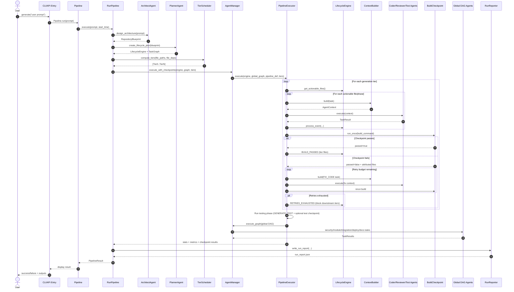

# Generation Pipeline Workflow (Prompt → Final Repository)

This document explains the **actual generation runtime** in this repository, from user prompt intake to final artifacts.

## 1) Entry points and top-level orchestration

A generation run starts from either:

- CLI: `codegen generate "<prompt>"` (`core/cli.py`), or
- API: endpoint that routes to the same pipeline facade (`core/pipeline.py`).

`Pipeline.run()` is the facade that starts live console/logging, then delegates to `RunPipeline.execute(user_prompt, start_time)`.

## 2) RunPipeline phases (high-level)

`RunPipeline.execute()` drives four phases:

1. **Architecture Design** — `ArchitectAgent.design_architecture(user_prompt)`
2. **Task Planning** — `PlannerAgent.create_lifecycle_plan(blueprint)`
3. **Code Generation & Review** — `AgentManager.execute_with_checkpoints(...)`
4. **Finalize** — workspace indexing + run report + cost summary

It also initializes optional tracing and sandboxes, creates dependency/embedding stores, computes dependency tiers, and enables checkpoint mode for compiled languages.

## 3) Core data contracts passed between components

### Primary objects

- `RepositoryBlueprint`: project name, tech stack, folder structure, file blueprints, architecture doc.
- `Task`: atomic unit with `task_type`, target `file`, metadata, retries, status.
- `TaskResult`: normalized agent output (`success`, `output`, `errors`, `files_modified`, `metrics`).
- `AgentContext`: what every agent receives (`task`, `blueprint`, target file blueprint, related files, architecture summary, dependency info).

### Why this matters

Every agent in the run receives an `AgentContext` and must return `TaskResult`; orchestration and lifecycle transitions depend on that uniform contract.

## 4) Planning model used at runtime

### 4.1 Lifecycle + global DAG

`LifecyclePlanBuilder.build()` creates:

- a per-file `LifecycleEngine` (state machine), and
- a smaller global `TaskGraph` for repo-wide tasks.

Global tasks include security scan, module review (+ fix tasks), integration tests, architecture review, deploy generation, and docs generation.

### 4.2 Declarative pipeline definition

`GENERATE_PIPELINE` defines:

- **Phase `code_generation`**: `GENERATE_FILE` + review loop + build checkpoint
- **Phase `testing`**: `GENERATE_TEST`
- **Global tasks**: security/module/architecture/integration/deploy/docs

### 4.3 Tier scheduler

`TierScheduler.compute_tiers()` groups files by dependency depth. Compiled-language runs perform repo-level checkpointing between tiers.

## 5) Runtime execution engine behavior

`AgentManager.execute_with_checkpoints(...)` delegates to `PipelineExecutor.execute(...)`.

`PipelineExecutor` handles:

1. **Tiered per-file lifecycle dispatch** (`_run_tier_lifecycles`)
2. **Repo-level build checkpoints** (`_run_checkpoint`)
3. **Test phase** (`_run_test_phase`)
4. Optional **repo-level test checkpoint** (`_run_test_checkpoint`)
5. **Global DAG execution** via `AgentManager.execute_graph`

It also wires event-bus callbacks so when a file is rewritten, dependents can be queued for re-verification.

## 6) File lifecycle state machine (per file)

`FileLifecycle` phases:

`PENDING → GENERATING → REVIEWING → (FIXING ↔ REVIEWING) → BUILDING → TESTING → PASSED`

Failure/loop controls:

- `RETRIES_EXHAUSTED` forces `FAILED`
- Review/test/build fix loops each have caps
- In interpreted languages, build phase auto-skips
- In checkpoint mode, files stay in `BUILDING` until tier checkpoint passes/fails

## 7) How context is assembled for each agent call

`ContextBuilder.build(task)` constructs `AgentContext` with ranked context:

1. Target file full content (when relevant)
2. Direct dependencies as AST stubs (preferred)
3. Semantic retrieval hits (embedding store)
4. Ranked review files (module/architecture reviews)

A hard context budget and file caps are enforced.

## 8) Agent-by-agent I/O and responsibilities (generation workflow)

## 8.1 ArchitectAgent

**Called in phase:** Architecture Design

**Input:** user prompt (from task metadata or description)

**Output:** `RepositoryBlueprint`

**Responsibility:** Convert natural-language requirements into concrete repo blueprint with file list, dependency hints, stack, and architecture doc.

## 8.2 PlannerAgent

**Called in phase:** Task Planning

**Input:** `RepositoryBlueprint`

**Output:** `(LifecycleEngine, TaskGraph)`

**Responsibility:** Build executable lifecycle plan and global DAG.

## 8.3 CoderAgent

**Called in phases/tasks:** `GENERATE_FILE`, `FIX_CODE`

**Input:** `AgentContext` (target blueprint + related files + deps + metadata)

**Output:** `TaskResult` with generated/modified files

**Responsibility:**

- Generate source/config files
- Perform targeted fix cycles (review/test/build-triggered)
- Enforce guardrails (e.g., reject destructive rewrites)

## 8.4 ReviewerAgent

**Called in tasks:** `REVIEW_FILE`, `REVIEW_MODULE`, `REVIEW_ARCHITECTURE`

**Input:** `AgentContext` (+ structured review prompt)

**Output:** `TaskResult` derived from validated review JSON (`passed`, findings)

**Responsibility:** Structured correctness and architecture review with critical/warning/info findings.

## 8.5 BuildVerifierAgent (legacy/per-file verifier)

**Called in tasks:** `VERIFY_BUILD` (if used)

**Input:** `AgentContext` + terminal

**Output:** `TaskResult` pass/fail with compiler output

**Responsibility:** Run language build command and report compile/type errors. (Primary generation path now favors repo-level checkpoints.)

## 8.6 TestAgent

**Called in phase:** testing (`GENERATE_TEST`)

**Input:** target source file + dependency snippets + exports

**Output:** `TaskResult` with test file(s), and optional source/test fixes after run-loop

**Responsibility:**

- Generate runnable tests per language conventions
- Execute targeted test command (when terminal exists)
- Attempt bounded autonomous fix loop across test/source

## 8.7 SecurityAgent

**Called in global DAG:** `SECURITY_SCAN`

**Input:** repository context (+ optional bandit findings)

**Output:** `TaskResult` with security summary and findings

**Responsibility:** Combine static scan + LLM vulnerability review with strict JSON schema.

## 8.8 IntegrationTestAgent

**Called in global DAG:** `GENERATE_INTEGRATION_TEST`

**Input:** architecture summary + endpoint code + module summaries

**Output:** `TaskResult` with integration test artifact path

**Responsibility:** Generate end-to-end cross-module integration tests.

## 8.9 DeployAgent

**Called in global DAG:** `GENERATE_DEPLOY`

**Input:** blueprint + tech stack

**Output:** `TaskResult` with deployment files (`Dockerfile`, compose, k8s manifests)

**Responsibility:** Produce deployment artifacts with consistency/security rules.

## 8.10 WriterAgent

**Called in global DAG:** `GENERATE_DOCS`

**Input:** blueprint + related code snippets

**Output:** `TaskResult` with docs files (`docs/README.md`, `docs/API.md`, `docs/CHANGELOG.md`)

**Responsibility:** Generate project docs strictly from actual project details.

## 9) Error handling, retries, and gating

- Architecture phase has explicit timeout and failure return path.
- File lifecycle loops are bounded by max review/test/build fixes.
- Tier checkpoints perform retries and targeted file attribution/fixing.
- Failed checkpoint hard-blocks downstream tiers.
- Success criteria prioritize code correctness/checkpoint pass; test degradation is tracked separately.

## 10) End-of-run outputs

On completion, generation writes:

- repository files from all agents
- optional docs/deploy/integration artifacts
- indexed workspace metadata
- run report (`run_report.json` via `RunReporter`)
- pipeline result with elapsed time, stats, and token-cost summary

## 11) One-screen sequence summary

1. User prompt enters CLI/API
2. `Pipeline.run()` starts lifecycle wrappers
3. `RunPipeline` designs blueprint (Architect)
4. `RunPipeline` builds lifecycle+global graph (Planner)
5. Tier scheduler groups files by dependency depth
6. `PipelineExecutor` runs per-tier file lifecycle (Coder/Reviewer/Fix)
7. Build checkpoints run between tiers (attribution + targeted fixes)
8. Test phase runs (`TestAgent` with bounded fix loop)
9. Global DAG runs (Security, module/arch review, integration, deploy, docs)
10. Workspace indexed, report/costs emitted, final `PipelineResult` returned

## 12) Sequence diagram (runtime handoffs)

## 13) FAQ: Build verification scope and tier division

### Q1) Does build verification run per file or per tier?

In the **current generation path**, build verification is effectively **per tier** for compiled languages:

- `RunPipeline` computes tiers, then enables `lifecycle_engine.checkpoint_mode = True` for compiled targets.
- `PipelineExecutor` runs per-file generation/review inside a tier first, then runs a **repo-level build checkpoint** (`_run_checkpoint`) after the tier.
- If a checkpoint fails after retries, downstream tiers are blocked.

`BuildVerifierAgent` still exists and can run `VERIFY_BUILD` tasks, but the generation workflow primarily relies on tier checkpoints.

### Q2) How are tiers divided?

`TierScheduler.compute_tiers()` divides files by dependency depth using blueprint dependencies:

1. Keep only **internal dependencies** (deps that are in `file_paths`).
2. **Tier 0** = files whose internal deps are empty.
3. **Tier N** = files whose internal deps are all already assigned to earlier tiers.
4. Repeat until all files are assigned.
5. If a cycle is detected (no file can be scheduled), the scheduler breaks the cycle by selecting files with the **fewest unresolved dependencies** into the next tier.

So tiering is dependency-driven, not folder-driven.
